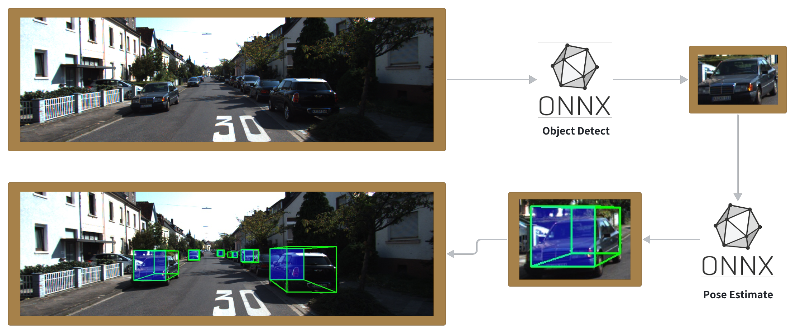
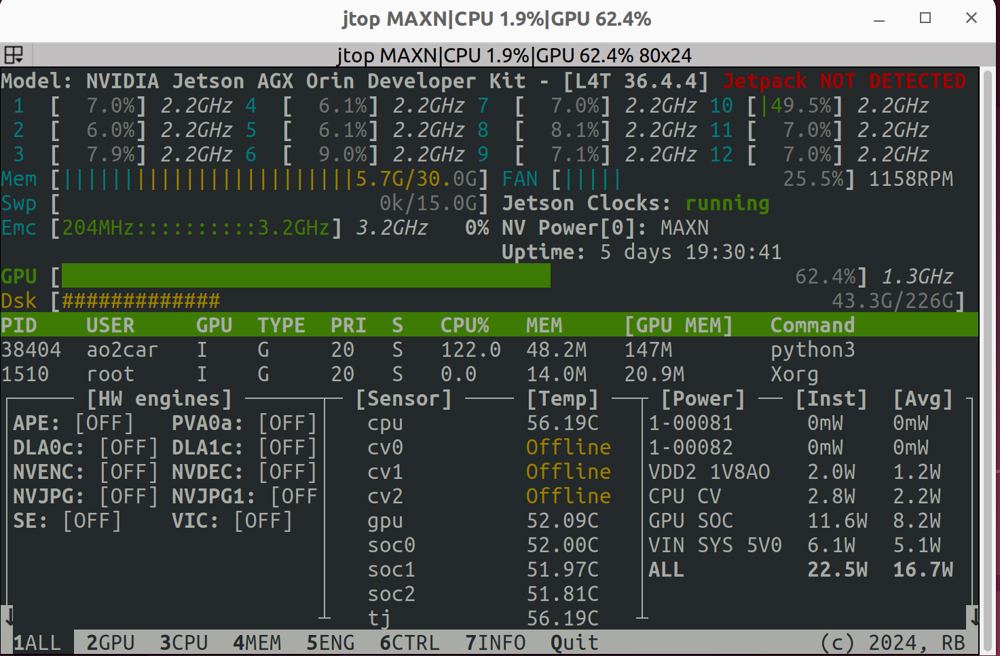
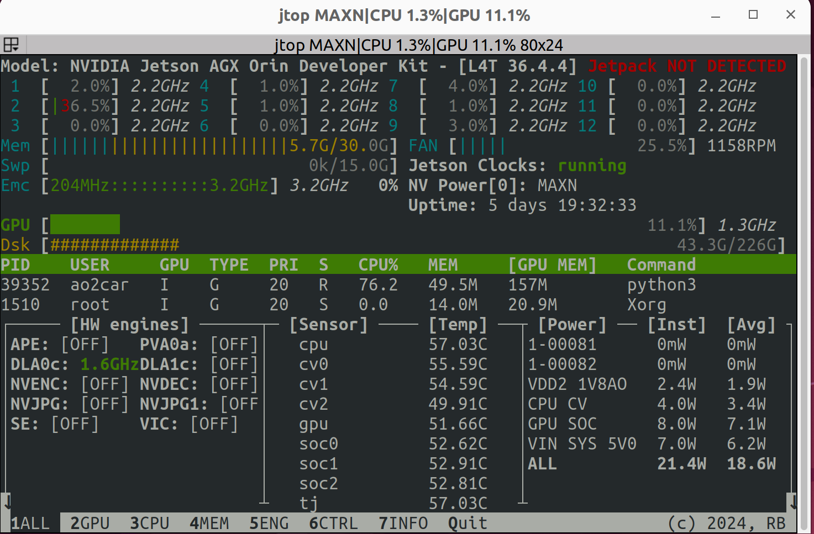

<p align="center"><strong>TrafficNet3D</strong></p>
<p align="center"><a href="https://github.com/Vulcan-YJX/TrafficNet3D/blob/dev/LICENSE"></a>


</p>
<p align="center">
    语言：<a href="./docs/README_en.md"><strong>English</strong></a> / <strong>中文</strong>
</p>

​	这个项目并没有完全开源，仅供参考使用。由于模型设计到工程优化，开源的部分仅以开源的 `ONNX` 模型作为替代。在真正应用时建议使用对应硬件平台的量化工具链，提高推理性能。




## 基本信息

| Installation method | Supported platform[s]    |
| ------------------- | ------------------------ |
| Source              | Jetpack 6.2.1 , Orin AGX |

------


## 环境准备

​	如果需要迁移至自己的硬件环境，请修改 `config` 文件中的 `calib_cam_to_cam.txt` 文件以适配实际的相机坐标系。示例图片为 `KITTI` 数据集中的测试样本。 

```bash
pip install onnxruntime opencv-python
```

​	运行测试脚本

```bash
python3 infer_3d.py
```

<table style="border: 1px solid #f44336; background-color: #ffcccb; padding: 10px;">
<tr>
  <td>⚠️ <strong>注意：</strong> 模型文件需自行准备。</td>
</tr>
</table>


## 性能指标

​	为与摄像头数量适配。目标检测网络被固定为 `(4,3,544,960)` 的 `int8` 序列化模型。分别测试了启用 `DLA` 和不启用 `DLA` 的两个版本。`jtop` 展示以 `MAXN`  模式，解除功耗锁的配置下跑出。



------



> [!IMPORTANT]
>
> 启用 `DLA` 可以有效降低 `GPU` 的占用，请保证网络尽可能多的支持 `DLA` 的层，如果反复触发 `allowGPUFallback` 将导致网络的负优化。使运行效率变低。可以使用 `nsys` 进行模型的分析。

------

